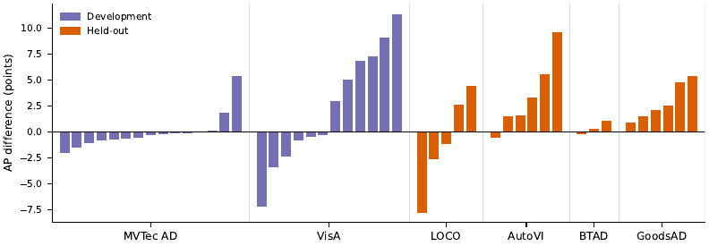

# GaLAD: Regularized Gaussian Mixtures for Training-Free Few-Shot Industrial Anomaly Detection

Code and results of the paper

> S. Villanueva López, E. Soria-Olivas, M. Sánchez-Montañés. *GaLAD: Regularized Gaussian Mixtures for
> Training-Free Few-Shot Industrial Anomaly Detection.* Submitted to *Electronics* (MDPI), 2026.

GaLAD sets up anomaly detection for a new product from one to five images of good parts. A frozen DINOv3
ViT-L/16 backbone provides the patch features of two hidden layers; each reference image is also rotated in
steps of 45 degrees. For each layer, the features are projected with PCA to 256 dimensions and modeled by a
Gaussian mixture with 12 components whose covariances are shrunk toward the covariance of all reference
patches:

    Sigma_k = (n_k C_k + kappa Lambda) / (n_k + kappa),   kappa = 2000

Each test patch is scored by the chi-square tail of its Mahalanobis distance to the nearest component,
`-log P(chi2_256 >= min_k delta_k^2)`; the score map is smoothed, and the image score is its 95th percentile,
averaged over the two layers. Fitting uses PCA and EM, without gradient-based training; the model occupies
5 MiB per product.

## Results

Image AP (%), mean over N in {1, 2, 4, 5} reference images and 5 draws (Tables 3 and 4 of the paper).
Development: MVTec AD + VisA (27 categories); held-out: MVTec LOCO, AutoVI, BTAD, GoodsAD (20 categories).

| | Development | Held-out | All 47 |
|---|---|---|---|
| AnomalyDINO (official: DINOv2-S, background masks) | 94.9 | 65.1 | 82.2 |
| AnomalyDINO (DINOv3-L, no mask) | 92.5 | 64.9 | 80.7 |
| **GaLAD (DINOv3-L, no mask)** | 93.5 | 66.6 | 82.1 |

Paired differences (GaLAD minus AnomalyDINO on DINOv3-L, 95% bootstrap CI over categories): +1.87
[+0.24, +3.41] on the 19 held-out categories fixed in advance, +1.75 [+0.17, +3.21] on all 20 held-out
categories. With identical features and post-processing, the Gaussian mixture improves AP over
nearest-neighbor matching by +2.01 (N = 2) and +1.66 (N = 5) points. AU-PRO (FPR <= 0.3) is 7.5 to 11.4
points higher than AnomalyDINO on DINOv3-L.



## Repository

| Path | Content |
|---|---|
| `galad/` | Reference implementation: data loading (`data.py`), DINOv3 features and rotations (`features.py`), GaLAD (`model.py`), AnomalyDINO scoring on the same backbone (`anomalydino.py`), metrics including the standard AU-PRO (`metrics.py`) |
| `scripts/run_eval.py` | Runs GaLAD and AnomalyDINO (DINOv3-L) on any set of categories, N and draws |
| `results/paper/` | Per-run results reported in the paper (see below) |
| `research/` | The research scripts that produced the paper results, as they were run |
| `docs/` | Figures |

### Result files (`results/paper/`)

| Paper | File |
|---|---|
| Tables 3, 4, A1, A2, A6; Figure 2 (GaLAD and AnomalyDINO on DINOv3-L, every category, N and draw) | `l_square.csv` |
| AnomalyDINO with its official configuration | `adino_official.csv` |
| Table 2 (1-NN on GaLAD features) | `knn_galad_features.csv` (GaLAD rows are in `l_square.csv`) |
| Table 5 (ablation on the development categories) | `ablation_development.csv` |
| Table 6 (backbones and cost) | `b_square.csv`, `h_square.csv`, `bench_*.csv` |
| Every number quoted in the text | `paper_numbers.md` |

Metrics are stored as fractions; the paper reports percentages. `method` is `galad` or `adino`.

## Setup

Python 3.11 or later, PyTorch 2.7, transformers 4.57 or later (DINOv3). A CUDA GPU is recommended.

```bash
pip install -e .            # or: uv sync
```

The DINOv3 weights are gated on Hugging Face: accept the license of
`facebook/dinov3-vitl16-pretrain-lvd1689m` and log in (`hf auth login`) before the first run.

### Datasets

Download the datasets from their original sources and place them under `data/`:

```
data/
  mvtec_AD/        https://www.mvtec.com/company/research/datasets/mvtec-ad
  VisA/            https://github.com/amazon-science/spot-diff   (with split_csv/1cls.csv)
  mvtec_loco_AD/   https://www.mvtec.com/company/research/datasets/mvtec-loco
  AutoVI/          https://zenodo.org/records/10459003
  btad/            https://github.com/pankajmishra000/VT-ADL      (converted to the MVTec AD layout)
  GoodsAD/         https://github.com/jianzhang96/GoodsAD
```

## Usage

```bash
python scripts/run_eval.py --datasets VisA/pcb1 --ns 1 2 --seeds 0
python scripts/run_eval.py --all                       # the 47 categories of the paper
```

Results are written to `results/reproduced/l_square.csv` with the same columns as `results/paper/l_square.csv`.

To use GaLAD on your own images:

```python
from PIL import Image
from galad import GaLAD
from galad.features import Backbone

net = Backbone("dinov3l")
refs, _ = net.references(["good_1.png", "good_2.png"])          # rotated reference views
model = GaLAD(net.layers).fit(refs)
test = net.extract([net.prep(Image.open("part.png").convert("RGB"))])
scores, maps = model.score(test)                                # image score and 448x448 anomaly map
```

The operating threshold has to be chosen for each product on normal images of that product.

## Citation

```bibtex
@article{villanueva2026galad,
  title   = {{GaLAD}: Regularized Gaussian Mixtures for Training-Free Few-Shot Industrial Anomaly Detection},
  author  = {Villanueva L{\'o}pez, Sergio and Soria-Olivas, Emilio and S{\'a}nchez-Monta{\~n}{\'e}s, Manuel},
  journal = {Electronics},
  year    = {2026},
  note    = {Submitted}
}
```

## License

MIT (see `LICENSE`). The datasets keep their own licenses.
